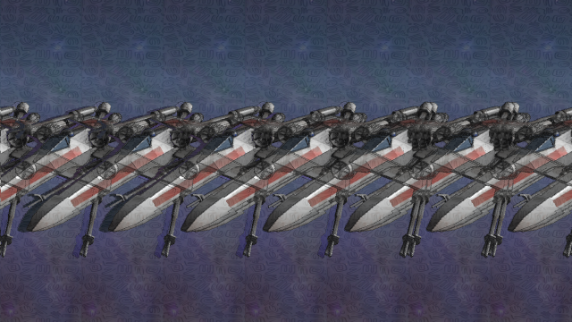

# Magic eye
Real time autostereogram rendering with OpenGL 4.3

## Features
- Configurable eye separation and observer distance
- Multiple scenes
- Different patterns: static, animated, procedural or texture based
- Toon shading rendering
- Scene color blending with object priority
- Scene edge detection and highlight
- Skinned animation: linear blending and dual quaternions blending supported
